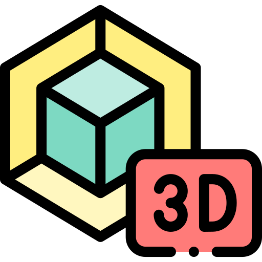

<h1 align="center">ft_transcendence</h1>

<p align="center">
	<b><i>This is a 42school's project that is about creating a pong website with many additional features.</i></b><br>
</p>
<p align="center">
	
	
	
	
	
</p>
<div align="center">
	
</div>

# Table of Contents

- [Preview](#preview)
- [Information](#information)
- [Installation](#installation)
- [Usage](#usage)

# Preview

<h3 align="center"><b>Login page</b></h3>
<div align="center">
	
</div>

<h3 align="center"><b>Home page</b></h3>
<div align="center">
	
</div>

<h3 align="center"><b>Game list + Player list</b></h3>
<div align="center">
	
</div>

<h3 align="center"><b>Game's Waiting room</b></h3>
<div align="center">
	
</div>

<h3 align="center"><b>Tournament's Waiting room + Chat</b></h3>
<div align="center">
	
</div>

<h3 align="center"><b>The Game (power-ups version)</b></h3>
<div align="center">
	
</div>

<h3 align="center"><b>Profile page</b></h3>
<div align="center">
	
</div>

<h3 align="center"><b>Mobile support</b></h3>
<div align="center">
	
	
</div>

<h3 align="center"><b>Grafana page (monitoring)</b></h3>
<div align="center">
	
</div>
</br>

# Information

In this project, we had a mandatory part and some modules to do. The mandatory part gives 25pts, and the objective for us was to go to 125pts.

100pts means the project is done, over 100pts means with bonus, max is 125pts.

To do so we had a list of modules that we can do to earn points, down below are the one we chose.

## Modules :
### Web
 Django ➝ 10pts \
 Bootstrap ➝ 5pts \
 PostgreSQL ➝ 5pts

### User management
 Standard user management ➝ 10pts \
  OAuth 2.0 with 42 ➝ 10pts

### Gameplay and user experience
  Remote player ➝ 10pts \
 Game cusomization options (powerups and random maps) ➝ 10pts \
 Live Chat ➝ 10pts

### AI-Algo
 AI Opponent ➝ 10pts \
 User and Game stats dashboards ➝ 5pts

### DevOps
 Monitoring system (grafana) ➝ 5pts

### Graphics
 Implementing 3D ➝ 10pts

### Accessibility
 Support on all devices ➝ 5pts \
 Expand browser compatibility ➝ 5pts \
 Multiple language supports ➝ 5pts

### That bring us to a total of 115pts + 25pts of the mandatory part which made 140pts.

# Installation

Firstly, create your own .env using the example one.

You need to change all ``SERVER_IP`` by the server ip (wow). \
Create, if you want, a webhook for alertmanager (not necessary, the server will still work if not set, you will just not receive any notifications in case of critical situations). \
Change, if you want, the ``API_SECRETKEY`` and ``API_CLIENTID`` by your 42's app. And to make the login through 42 work you also need to change the ``client_id`` in the request by your own at this location :

``backend/transcendence_backend/static/pages/Login.js, 294.`` \
``backend/transcendence_backend/static/pages/UpdateProfile.js, 185.``

After that, all you need to do is either:

```bash
make
```
**OR**
```bash
docker compose up --build
```

# Usage

The main website is accessible at ``https://SERVER_IP:8000`` (set in .env).

Grafana is accessbile at ``https://SERVER_IP:3000``.
