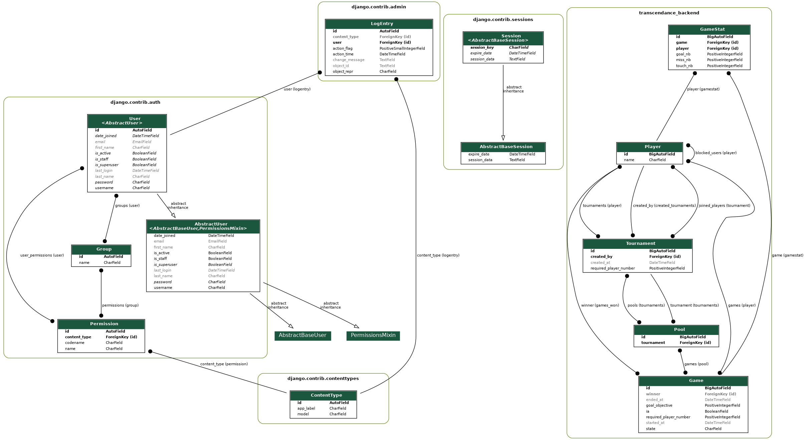

# ft_transcendance BACKEND

## Requirements

- Python 3.8+
- Have sudo access

``` sh
python3 --version
# should OUTPUT: Python 3.8.0 or higher
```

## Setup python dependencies in a virtual env

### Install poetry

Poetry is a dependency manager for python packages.

``` sh
curl -sSL https://install.python-poetry.org | python3 -
```

Then add `$HOME/.local/bin` to your PATH if it's not already.

``` sh
poetry --version
# Should OUTPUT: Poetry (version 1.6.1) or higher
```

### Use the dependencies

``` sh
cd ft_transcendance/backend # where pyproject.toml file is
poetry install # Install the dependencies
poetry shell # Do this any time you open your terminal
```

## Setup postgresql

### Install

``` sh

sudo apt-get update
sudo apt-get install postgresql postgresql-contrib
systemctl enable postgresql # for auto restart on reboot
sudo systemctl restart postgresql # may not be necessary ?

systemctl status postgresql
# You should see: Active: active (exited)
```

### Create the .env file

Duplicate `example.env`, name it `.env` and replace your credentials.
You can generate a `DJANGO_SECRET_KEY` by running `python ./scripts/generate_secret_key.py`

### Create DB

The following code-block creates a database named `transcendance_db` with a user `my_postgres_user` with password `my_postgres_pw`. Make sure to reflect your `.env` file.

``` sh

sudo -u postgres psql

CREATE DATABASE transcendance_db;
CREATE ROLE my_postgres_user LOGIN;
ALTER ROLE my_postgres_user WITH PASSWORD 'my_postgres_pw';

# Ctrl-D to quit
```

## Run the server

``` sh
python manage.py createsuperuser
# Do this only once

python manage.py makemigrations your_app_name
# Run this if you changed the models.py file

python manage.py migrate your_app_name
# This applies model changes to the db

python manage.py runserver
# You can now access django-admin interface at http://127.0.0.1:8000/admin/ with the superuser credentials
```

## Information

### Note on migration

When you make changes to your Django models (e.g., adding, modifying, or deleting fields).
- `cd` where the `manage.py` file is
- Run `python manage.py makemigrations` to generate migration files for the changes.
- Run `python manage.py migrate` to apply the changes to the database.

### Explanation of the python dependencies

- django: backend framework
- psycopg2-binary: adapter for connecting Python applications to PostgreSQL databases.
- python-dotenv: load the content of .env as environment variable
- pygraphviz: a graphic library, is necessary for `/scripts/visualize_db.sh`

### Folder structure

```plaintext
├── backend
│ ├── example.env
│ ├── images/
│ ├── manage.py
│ ├── poetry.lock
│ ├── pyproject.toml
│ ├── pong/
│ ├── README.md
│ ├── scripts/
│ │ ├── visualize_db.sh
│ │ ├── generate_secret_key.py
│ ├── transcendance_backend/
│ │ ├── admin.py
│ │ ├── asgi.py
│ │ ├── migrations/
│ │ ├── models.py
│ │ ├── settings.py
│ │ ├── urls.py
│ │ ├── wsgi.py
│ │ ├── __init__.py

```

### Visualize DB

``` sh
# To generate a png UML diagram of the database
bash ./scripts/visualize_db
```




## Pong

To try the pong with a python frontend

``` sh
cd backend/
python ./pong/test/app.py
```
